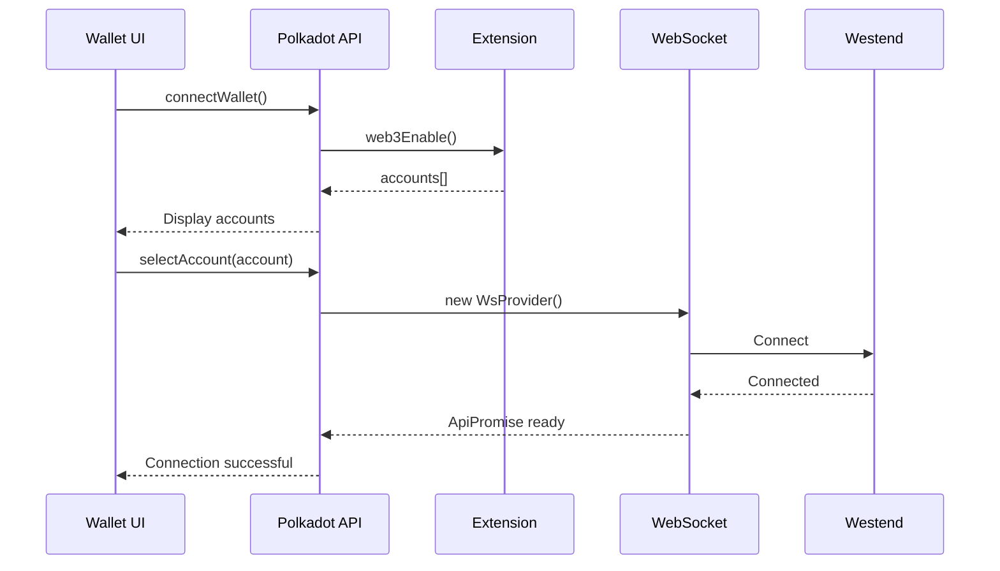
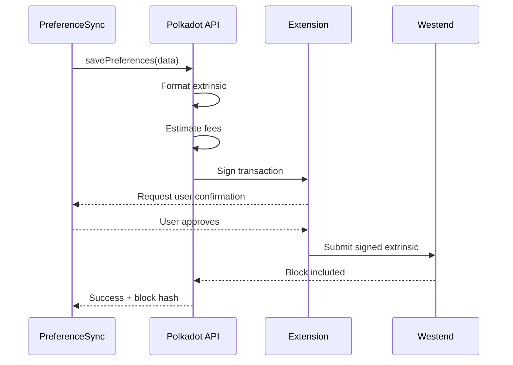

# System Architecture Documentation

**File**: p0s8f1.md  
**SCIS Version**: 4.1  
**Last Updated**: November 11, 2025  
**Status**: Active

---

## Table of Contents

1. [Architecture Overview](#architecture-overview)
2. [System Layers](#system-layers)
3. [Component Interactions](#component-interactions)
4. [Data Flow](#data-flow)
5. [Polkadot Integration](#polkadot-integration)
6. [Scalability Considerations](#scalability-considerations)
7. [Security Architecture](#security-architecture)
8. [Deployment Architecture](#deployment-architecture)

---

## Architecture Overview

### High-Level Architecture

```
┌─────────────────────────────────────────────────────────────┐
│                      USER INTERFACE                          │
│  (React Components - Phase 1)                               │
│  ┌──────────┐  ┌──────────┐  ┌──────────┐  ┌──────────┐  │
│  │  Search  │  │  Filters │  │Newsletter│  │  Wallet  │  │
│  │ p1s0f2   │  │ p1s0f3   │  │ p1s0f4   │  │ p1s0f5   │  │
│  └──────────┘  └──────────┘  └──────────┘  └──────────┘  │
└────────────────────────┬────────────────────────────────────┘
                         │
┌────────────────────────▼────────────────────────────────────┐
│               API INTEGRATION LAYER                          │
│  (Phase 1)                                                   │
│  ┌──────────────────┐      ┌──────────────────┐           │
│  │  API Client      │      │  Polkadot Wrapper│           │
│  │  p1s3f1          │      │  p1s3f2          │           │
│  └──────────────────┘      └──────────────────┘           │
└────────────────────────┬────────────────────────────────────┘
                         │
┌────────────────────────▼────────────────────────────────────┐
│                 CORE LOGIC LAYER                             │
│  (Phase 0)                                                   │
│  ┌──────────┐  ┌──────────┐  ┌──────────┐  ┌──────────┐  │
│  │  Query   │  │  Filter  │  │Newsletter│  │ Polkadot │  │
│  │ Processor│  │  Engine  │  │Generator │  │Connector │  │
│  │ p0s2f1   │  │ p0s0f4   │  │ p0s2f3   │  │ p0s0f6   │  │
│  └──────────┘  └──────────┘  └──────────┘  └──────────┘  │
└────────────────────────┬────────────────────────────────────┘
                         │
┌────────────────────────▼────────────────────────────────────┐
│                    DATA LAYER                                │
│  ┌────────────────────────┐  ┌──────────────────────────┐  │
│  │   Mock Data (PoC)      │  │  Polkadot Westend        │  │
│  │   p1s1f1-5.json        │  │  (On-chain Storage)      │  │
│  │   p1s1f6.json          │  │                          │  │
│  └────────────────────────┘  └──────────────────────────┘  │
└─────────────────────────────────────────────────────────────┘
```

### Design Principles

1. **Separation of Concerns**: Clear boundaries between UI, logic, and data
2. **Component Modularity**: Each component has a single, well-defined responsibility
3. **SCIS Compliance**: All components traceable via SCIS coordinates
4. **Scalability**: Architecture supports evolution from PoC to production
5. **Web3 Native**: Blockchain integration is foundational, not bolted-on

---

## System Layers

### Layer 1: User Interface (React Components)

**Purpose**: Provide intuitive, responsive user interface  
**Technology**: React 18, Tailwind CSS, Lucide Icons  
**Location**: Phase 1 (p1s0f\*.jsx)

#### Components

| Component          | File                              | Purpose                              |
| ------------------ | --------------------------------- | ------------------------------------ |
| **App Root**       | p1s0f6.jsx (Cp1s0f6.1)            | Top-level component, orchestrates UI |
| **Search**         | p1s0f2.jsx (Cp1s0f2.1, Cp1s0f2.2) | Search input and results display     |
| **Filter Panel**   | p1s0f3.jsx (Cp1s0f3.1, Cp1s0f3.2) | Dynamic filter rendering             |
| **Newsletter**     | p1s0f4.jsx (Cp1s0f4.1)            | Newsletter preview generation        |
| **Wallet Connect** | p1s0f5.jsx (Cp1s0f5.1, Cp1s0f5.2) | Polkadot wallet integration UI       |

#### State Management

```javascript
// App-level state (p1s0f6.jsx)
{
  searchQuery: string,
  searchResults: Array<Item>,
  selectedTopic: string,
  activeFilters: Object,
  newsletterContent: string,
  walletConnected: boolean,
  userAccount: string | null,
  preferences: UserPreferences
}
```

#### UI Flow

```
User Input (Search)
  ↓
Query Validation
  ↓
Loading State
  ↓
Display Results + Dynamic Filters
  ↓
User Selects Filters
  ↓
Re-render Results
  ↓
Generate Newsletter Preview
  ↓
[Optional] Save to Polkadot
```

---

### Layer 2: API Integration

**Purpose**: Bridge between UI and core logic  
**Technology**: JavaScript ES6+, Async/Await  
**Location**: Phase 1 (p1s3f\*.js)

#### API Client (p1s3f1.js - Cp1s3f1.1)

```javascript
class ApiClient {
  // Generic API client for future backend calls
  async get(endpoint) {
    /* ... */
  }
  async post(endpoint, data) {
    /* ... */
  }

  // PoC: Returns mock data directly
  async search(query) {
    return MockDataManager.search(query);
  }
}
```

#### Polkadot API Wrapper (p1s3f2.js - Cp1s3f2.1)

```javascript
class PolkadotAPI {
  async connectWallet() {
    /* ... */
  }
  async getAccounts() {
    /* ... */
  }
  async savePreferences(account, preferences) {
    /* ... */
  }
  async loadPreferences(account) {
    /* ... */
  }

  // Error handling, retry logic, loading states
}
```

**Key Responsibilities**:

- Abstract Polkadot.js complexity from UI components
- Provide React-friendly async functions
- Handle errors and loading states
- Manage WebSocket connection lifecycle

---

### Layer 3: Core Logic

**Purpose**: Business logic, data processing, blockchain interaction  
**Technology**: JavaScript ES6+, Polkadot.js API  
**Location**: Phase 0 (p0s0f*.js, p0s2f*.js)

#### Application Orchestrator (p0s0f1.js - Cp0s0f1.1)

```javascript
class AppOrchestrator {
  constructor() {
    this.config = AppConfig;
    this.mockDataManager = new MockDataManager();
    this.filterEngine = new FilterTemplateEngine();
    this.polkadotConnector = new PolkadotConnector();
  }

  async initialize() {
    // Load all services
    // Connect to Polkadot
    // Log startup
  }
}
```

**Responsibilities**:

- Initialize all core services
- Coordinate component lifecycle
- Manage global configuration
- Handle errors and logging

#### Filter Template Engine (p0s0f4.js)

**Cp0s0f4.1 - FilterTemplateEngine**:

```javascript
class FilterTemplateEngine {
  loadTemplates() {
    // Load p1s1f6.json
  }

  getFiltersForTopic(topicId) {
    // Return filter array for topic
  }
}
```

**Cp0s0f4.2 - QueryContextAnalyzer**:

```javascript
function analyzeQueryContext(query) {
  // Extract keywords
  // Match against topic keywords
  // Calculate confidence score
  // Return detected topic
}
```

**Algorithm**:

1. Normalize query (lowercase, trim)
2. Extract keywords (remove stop words)
3. Match against `topic_keywords` in p1s1f6.json
4. Calculate match score per topic
5. Return highest scoring topic (if confidence > 0.7)

#### Mock Data Manager (p0s0f5.js - Cp0s0f5.1)

```javascript
class MockDataManager {
  constructor() {
    this.data = {
      movies: require("p1s1f1.json"),
      restaurants: require("p1s1f2.json"),
      // ...
    };
  }

  search(query, topic, filters) {
    // Get relevant data
    // Apply filters
    // Return results
  }
}
```

#### Query Processor (p0s2f1.js)

**Cp0s2f1.1 - QueryParser**:

```javascript
class QueryParser {
  parse(query) {
    // Normalize
    // Validate
    // Return structured query
  }
}
```

**Cp0s2f1.2 - KeywordExtractor**:

```javascript
function extractKeywords(query) {
  // Tokenize
  // Remove stop words
  // Stem/lemmatize
  // Return keyword array
}
```

#### Filter Selector (p0s2f2.js - Cp0s2f2.1)

```javascript
class FilterSelector {
  selectFilters(query) {
    const topic = QueryContextAnalyzer(query);
    const filters = FilterTemplateEngine.getFiltersForTopic(topic);
    return filters;
  }
}
```

#### Newsletter Generator (p0s2f3.js - Cp0s2f3.1)

```javascript
class NewsletterGenerator {
  generate(results, activeFilters) {
    // Filter results by newsletter-specific flags
    // Format as HTML
    // Include rich media based on filters
    // Return newsletter content
  }
}
```

#### Polkadot Connector (p0s0f6.js)

**Cp0s0f6.1 - PolkadotConnector**:

```javascript
class PolkadotConnector {
  async connect(network) {
    this.api = await ApiPromise.create({
      provider: new WsProvider(rpcUrl),
    });
  }

  async disconnect() {
    /* ... */
  }
  getApi() {
    return this.api;
  }
}
```

**Cp0s0f6.2 - PreferenceStorage**:

```javascript
class PreferenceStorage {
  async save(account, preferences) {
    // Format data
    // Estimate fees
    // Submit extrinsic
    // Wait for confirmation
    // Return block hash
  }

  async load(account) {
    // Query chain storage
    // Parse data
    // Validate
    // Return preferences
  }
}
```

---

### Layer 4: Data Layer

**Purpose**: Persistent data storage  
**Technology**: JSON files (PoC), Polkadot blockchain  
**Location**: Phase 1 (p1s1f\*.json), Westend Testnet

#### Mock Data Structure

Each topic file (p1s1f1-5.json) contains:

```json
{
  "metadata": {
    /* File info */
  },
  "search_results": [
    /* 5 items */
  ],
  "related_content": {
    /* Suggestions */
  }
}
```

Total: 25 items across 5 topics, ~15-30 fields per item

#### Filter Templates (p1s1f6.json)

```json
{
  "topic_keywords": {
    /* Keyword mappings */
  },
  "filter_templates": {
    "movies": {
      "filters": [
        /* 8 filters */
      ]
    }
    // 5 topics total
  }
}
```

#### On-Chain Storage (Polkadot)

**Storage Key**: `userPreferences:<accountId>`  
**Data Format**:

```json
{
  "user_account": "5Grw...",
  "preferences": {
    "topics": ["movies", "restaurants"],
    "active_filters": {
      /* Per-topic filters */
    },
    "newsletter_frequency": "weekly",
    "last_updated": "ISO-8601 timestamp"
  }
}
```

**Storage Method**: Westend testnet extrinsic submission  
**Retrieval**: Query chain storage by account ID

---

## Component Interactions

### Search Flow

```
User types query
  ↓
[Cp1s0f2.1] SearchInput captures input
  ↓
[Cp0s2f1.1] QueryParser normalizes query
  ↓
[Cp0s2f1.2] KeywordExtractor extracts keywords
  ↓
[Cp0s0f4.2] QueryContextAnalyzer determines topic
  ↓
[Cp0s2f2.1] FilterSelector loads filters for topic
  ↓
[Cp1s0f3.1] FilterPanel renders dynamic filters
  ↓
[Cp0s0f5.1] MockDataManager fetches relevant data
  ↓
[Cp1s0f2.2] SearchResults displays items
```

### Filter Selection Flow

```
User toggles filter
  ↓
[Cp1s0f3.2] FilterCheckbox updates state
  ↓
[Cp1s0f3.1] FilterPanel propagates to parent
  ↓
[Cp1s0f2.2] SearchResults re-renders with filtered data
  ↓
[Cp0s2f3.1] NewsletterGenerator updates preview
  ↓
[Cp1s0f4.1] NewsletterPreview shows new content
```

### Polkadot Integration Flow

```
User clicks "Connect Wallet"
  ↓
[Cp1s0f5.1] WalletConnect initiates connection
  ↓
[Cp1s3f2.1] PolkadotAPI calls extension
  ↓
[Cp0s0f6.1] PolkadotConnector establishes WebSocket
  ↓
User selects account
  ↓
[Cp1s0f5.1] Displays connected state
  ↓
User clicks "Save Preferences"
  ↓
[Cp1s0f5.2] PreferenceSync collects state
  ↓
[Cp1s3f2.1] PolkadotAPI formats data
  ↓
[Cp0s0f6.2] PreferenceStorage submits extrinsic
  ↓
Wait for block confirmation
  ↓
[Cp1s0f5.2] Displays success message
```

---

## Data Flow

### Read Path (Search)

```
UI Layer          API Layer         Logic Layer        Data Layer
────────────────  ────────────────  ─────────────────  ──────────────
SearchInput  ──→  ApiClient    ──→  QueryParser   ──→  (in-memory)
    │                               ContextAnalyzer
    │                               FilterSelector
    │                                    │
    └───────────────────────────────────▼
                                   MockDataManager ──→  p1s1f*.json
                                        │
    ┌───────────────────────────────────┘
    │
    ▼
SearchResults ←── ApiClient    ←──  (results returned)
```

### Write Path (Preferences)

```
UI Layer           API Layer          Logic Layer         Blockchain
───────────────   ─────────────────   ─────────────────   ──────────────
WalletConnect ──→ PolkadotAPI   ──→  PolkadotConnector ──→ Westend RPC
    │                                 PreferenceStorage        │
    │                                      │                   │
    │                                      │ (submit tx)       │
    │                                      │                   │
    │                                      │ ←─ (confirmation) │
    │                                      │                   │
    └──────────────────────────────────────┘
                (success callback)
```

---

## Polkadot Integration

### Architecture Diagram

```
┌─────────────────────────────────────────────────────────────┐
│                    FRONTEND (Browser)                        │
│                                                              │
│  ┌────────────────┐           ┌──────────────────┐         │
│  │  Wallet UI     │           │  Polkadot API    │         │
│  │  p1s0f5.jsx    │ ────────→ │  Wrapper         │         │
│  │                │           │  p1s3f2.js       │         │
│  └────────────────┘           └──────────────────┘         │
│                                         │                    │
└─────────────────────────────────────────┼────────────────────┘
                                          │
                                          │ WebSocket
                                          │
┌─────────────────────────────────────────▼────────────────────┐
│              POLKADOT.JS EXTENSION                           │
│  (Manages Private Keys, Signs Transactions)                  │
└─────────────────────────────────────────┬────────────────────┘
                                          │
                                          │ wss://
                                          │
┌─────────────────────────────────────────▼────────────────────┐
│                 WESTEND TESTNET                              │
│                                                              │
│  ┌──────────────┐    ┌──────────────┐   ┌──────────────┐  │
│  │  RPC Node    │ ←→ │  Validators  │ ←→│   Storage    │  │
│  │              │    │              │   │  (Prefs)     │  │
│  └──────────────┘    └──────────────┘   └──────────────┘  │
└─────────────────────────────────────────────────────────────┘
```

### Connection Sequence



### Transaction Sequence



### Error Handling

```javascript
try {
  await polkadotAPI.savePreferences(account, preferences);
} catch (error) {
  if (error.code === "WALLET_NOT_FOUND") {
    // Prompt user to install extension
  } else if (error.code === "USER_REJECTED") {
    // Transaction cancelled by user
  } else if (error.code === "INSUFFICIENT_FUNDS") {
    // Not enough tokens for fees
  } else if (error.code === "NETWORK_ERROR") {
    // Connection issues, retry
  } else {
    // Generic error handling
  }
}
```

---

## Scalability Considerations

### Current PoC Limitations

1. **Static Mock Data**: 25 hardcoded items
2. **No Caching**: Data reloaded on every search
3. **Single User Context**: No multi-user consideration
4. **Synchronous Processing**: No background jobs

### Scaling to MVP (1K Users)

**Changes Required**:

- Replace mock data with API connectors (TMDb, Yelp, etc.)
- Implement client-side caching (localStorage, IndexedDB)
- Add pagination for search results
- Optimize Polkadot connection (connection pooling)

**Performance Targets**:

- Search response: < 200ms
- Filter render: < 50ms
- Wallet connection: < 3 seconds
- Preference save: < 10 seconds

### Scaling to 10K Users

**Infrastructure**:

- CDN for static assets (Cloudflare)
- API rate limiting and caching
- Database for user preferences (fallback to local)
- Load balancing for API servers

**Polkadot Optimization**:

- Batch preference updates
- Use of Polkadot storage caching
- Off-chain workers for heavy computation
- Parachain for dedicated storage

### Scaling to 100K+ Users

**Architecture Evolution**:

```
┌────────────────────────────────────────────────────────────┐
│  CDN (CloudFlare)  →  Static Assets                        │
└───────────────────┬────────────────────────────────────────┘
                    │
┌───────────────────▼────────────────────────────────────────┐
│  Load Balancer  →  API Gateway                             │
└───────────────────┬────────────────────────────────────────┘
                    │
      ┌─────────────┼─────────────┐
      │             │             │
┌─────▼─────┐ ┌────▼─────┐ ┌────▼─────┐
│ API Node 1│ │API Node 2│ │API Node 3│
└─────┬─────┘ └────┬─────┘ └────┬─────┘
      │            │            │
      └────────────┼────────────┘
                   │
      ┌────────────┼────────────┐
      │            │            │
┌─────▼──────┐ ┌──▼────────┐ ┌─▼──────────┐
│  Database  │ │ Polkadot  │ │   Cache    │
│  (Postgres)│ │ Parachain │ │   (Redis)  │
└────────────┘ └───────────┘ └────────────┘
```

**Key Additions**:

- Microservices architecture
- Message queue (RabbitMQ, Kafka)
- ML model serving infrastructure
- Analytics pipeline
- Monitoring and observability (Grafana, Prometheus)

---

## Security Architecture

### Current Security Measures

1. **No Server-Side Storage**: User data only in browser or blockchain
2. **Wallet-Based Auth**: Polkadot extension handles private keys
3. **HTTPS Only**: All connections encrypted
4. **No Sensitive Data Logging**: User info anonymized in logs

### Authentication Flow

```
1. User connects Polkadot wallet
2. Extension provides account address (public key)
3. App uses account address as user identifier
4. All preferences tied to account address
5. No passwords or session tokens needed
```

### Data Privacy

**What We Store**:

- Search preferences (on-chain, user-controlled)
- Filter selections (on-chain, user-controlled)
- Newsletter preferences (on-chain, user-controlled)

**What We DON'T Store**:

- Search history
- Personal information
- Usage analytics (unless explicitly opted-in)
- IP addresses or tracking data

### Threat Model

| Threat                | Mitigation                                            |
| --------------------- | ----------------------------------------------------- |
| **Wallet Compromise** | Extension security, hardware wallet support           |
| **Man-in-the-Middle** | HTTPS only, WebSocket TLS                             |
| **XSS Attacks**       | React's built-in escaping, CSP headers                |
| **Data Leakage**      | Minimal data collection, on-chain encryption (future) |
| **Denial of Service** | Rate limiting, Cloudflare protection                  |

### Future Security Enhancements

1. **Encrypted On-Chain Storage**: Preferences encrypted before storage
2. **Zero-Knowledge Proofs**: Prove preference match without revealing data
3. **Multi-Sig Accounts**: Shared account security
4. **Audit Logs**: Transparent transaction history
5. **Bug Bounty Program**: Community security testing

---

## Deployment Architecture

### Development Environment

```
Developer Machine
  │
  ├─ npm run dev (Vite Dev Server)
  │   └─ Hot reload at localhost:5173
  │
  ├─ Local Polkadot Node (Optional)
  │   └─ For testing without testnet
  │
  └─ Browser Extensions
      └─ Polkadot.js, React DevTools
```

### PoC Deployment (Vercel)

```
GitHub Repository
  │
  │ (Push to main)
  │
  ▼
Vercel Build Pipeline
  │
  ├─ npm install
  ├─ npm run build
  │   └─ Vite builds to /dist
  │
  └─ Deploy to CDN
      │
      └─ https://polkadot-discovery-poc.vercel.app
```

**Configuration**:

- Build Command: `npm run build`
- Output Directory: `dist`
- Node Version: 20.x
- Environment Variables from p0s1f2.json

### Production Deployment (Future)

```
┌────────────────────────────────────────────────────┐
│  GitHub Actions CI/CD                              │
│  ├─ Run Tests                                      │
│  ├─ Build Docker Image                             │
│  ├─ Push to Container Registry                     │
│  └─ Deploy to Kubernetes                           │
└────────────────────────────────────────────────────┘
                    │
                    ▼
┌────────────────────────────────────────────────────┐
│  Kubernetes Cluster                                │
│  ├─ Frontend Pods (React App)                      │
│  ├─ API Pods (Backend Services)                    │
│  ├─ Worker Pods (ML Inference)                     │
│  └─ Ingress (Load Balancer)                        │
└────────────────────────────────────────────────────┘
                    │
                    ▼
┌────────────────────────────────────────────────────┐
│  External Services                                 │
│  ├─ Polkadot Parachain                             │
│  ├─ Content APIs (TMDb, Yelp, etc.)               │
│  ├─ Database (PostgreSQL)                          │
│  └─ Cache (Redis)                                  │
└────────────────────────────────────────────────────┘
```

---

## Monitoring & Observability

### Logging Strategy

**SCIS-Compliant Logs** (p0s7f1.json):

```json
{
  "timestamp": "2025-11-11T10:01:15.789Z",
  "level": "info",
  "component": "Cp1s0f2.1",
  "file": "p1s0f2.jsx",
  "event": "user_search",
  "message": "User performed search query",
  "details": {
    "query": "thriller movies 2024"
  }
}
```

**Log Levels**:

- `debug`: Development debugging
- `info`: Normal operation events
- `warning`: Potential issues
- `error`: Failures requiring attention
- `success`: Successful operations

### Performance Monitoring

**Key Metrics**:

- Time to First Byte (TTFB)
- Largest Contentful Paint (LCP)
- First Input Delay (FID)
- Cumulative Layout Shift (CLS)
- Search query latency
- Filter render time
- Wallet connection time

**Tools**:

- Lighthouse (built into Chrome)
- Web Vitals library
- Custom performance marks

### Error Tracking

**Future Integration**:

- Sentry for error tracking
- LogRocket for session replay
- Polkadot.js telemetry

---

## Conclusion

This architecture provides:

- ✅ Clear separation of concerns
- ✅ Scalable foundation from PoC to production
- ✅ SCIS compliance for traceability
- ✅ Secure Polkadot integration
- ✅ Modern frontend best practices

The system is designed to demonstrate the core innovation (dynamic filters + Web3 data sovereignty) while maintaining a clear path to a production-grade platform.

For implementation details, refer to:

- **Component Map**: p0s0f2.json
- **Dependency Map**: p0s0f3.json
- **Polkadot Guide**: p0s8f3.md
- **Project Spec**: p10s0f1.txt
